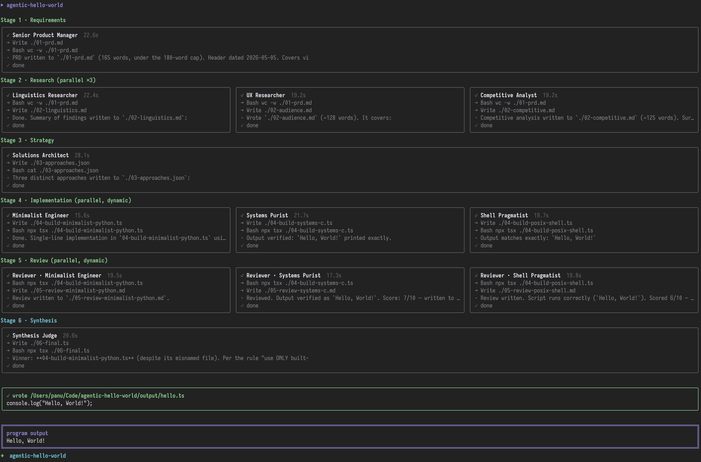

# agentic-hello-world

A deliberately convoluted, multi-stage, multi-agent workflow that produces a single `console.log("Hello, World!")` program.

Eleven Claude agents — across six pipeline stages — gather requirements, do research, propose architectures, build, review, and synthesize a final implementation. The output is `output/hello.ts`. The journey is the point.



## The pipeline

| Stage | Agents | What happens |
|------:|:-------|:-------------|
| 1 | Senior Product Manager | Writes a jargon-heavy PRD for "Hello, World!" |
| 2 | Linguistics Researcher · UX Researcher · Competitive Analyst | Three parallel research tracks |
| 3 | Solutions Architect | Proposes 3 distinct architectural approaches |
| 4 | *(dynamic ×3)* | Three engineers each implement one of the proposed approaches in parallel |
| 5 | *(dynamic ×3)* | Three reviewers critique and score each candidate in parallel |
| 6 | Synthesis Judge | Picks a winner or merges, then writes the final program |

Stage 4 and 5 are populated at runtime from the strategist's output, so the engineer titles and review focus differ on every run.

## How agents collaborate

Each agent runs as a `query()` call to the [Claude Agent SDK](https://www.npmjs.com/package/@anthropic-ai/claude-agent-sdk) with the `Read`, `Write`, `Edit`, and `Bash` tools enabled and `cwd` pinned to a per-run `.workdir/` directory. Agents pass artifacts to one another by reading and writing files there:

```
.workdir/
  01-prd.md
  02-linguistics.md
  02-audience.md
  02-competitive.md
  03-approaches.json
  04-build-<slug>.ts
  05-review-<slug>.md
  06-final.ts
```

Builders verify their own code by running `npx tsx ./04-build-<slug>.ts` via Bash; reviewers do the same to confirm output before scoring.

## The CLI

The terminal UI is built with [Ink](https://github.com/vadimdemedes/ink). Each stage renders as a row of bordered panels — one per agent. Live state:

- **Pending**: gray border, dimmed
- **Running**: cyan border, spinner, live tool-use log
- **Done**: gray border, full log preserved
- **Error**: red border

Extended thinking is enabled (`maxThinkingTokens: 3000`, `includePartialMessages: true`) and streamed deltas are shown as a `🧠 …` tail line in the active panel, then committed to the log as a one-line summary when the thinking block ends.

The panel body height adapts to terminal rows.

## Running it

```bash
npm install
npm start
```

Requires Claude Code to be installed and authenticated (the SDK uses the local `claude` executable).

When the workflow finishes, the final program is written to `output/hello.ts` and executed; its stdout is shown in the magenta box at the bottom of the UI.

## Project structure

```
agent/
  agents.ts     # prompt builders for each role
  cli.tsx      # Ink entry point — renders the UI and runs the workflow
  runner.ts    # single-agent execution + log/thinking capture
  store.ts     # subscribable state (stages, agents, logs, final output)
  ui.tsx       # Ink components
  workflow.ts  # 6-stage orchestration with dynamic agent registration
scripts/
  test-sdk.ts  # standalone SDK smoke test (npm run test:sdk)
src/, index.html, public/  # vestigial Vite scaffold, ignore
```

## Caveats

- Eleven agent calls with tool use and extended thinking — a full run is ~3 minutes and costs real API tokens.
- The Vite scaffold (`src/`, `index.html`, etc.) is left over from project init and unused.
